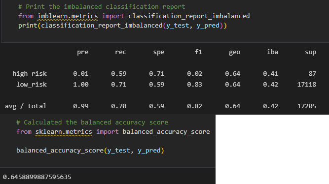
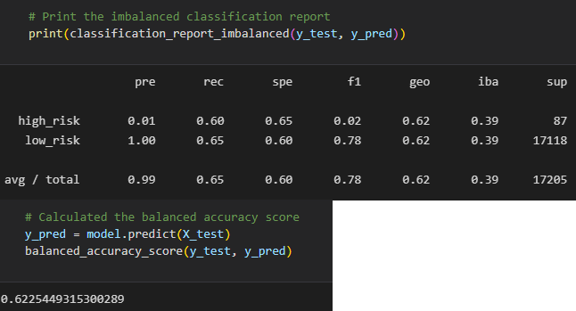
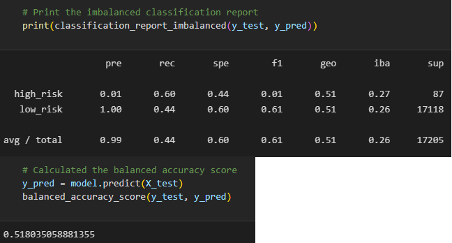
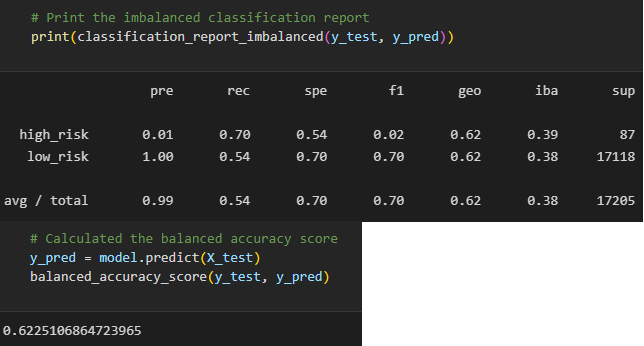
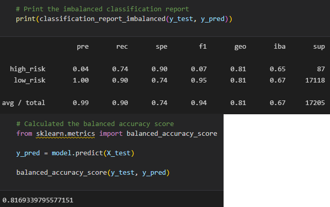
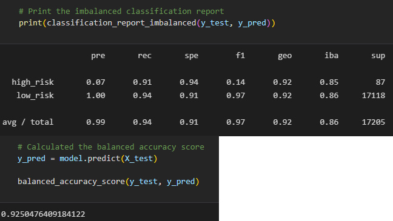

# Supervised Machine Learning Credit Risk Challenge

## Overview
This is an analysis looking at six different machine learning models applied to a credit card risk. After the dataset was prepared, the low risk and high risk loans were isolated, and samples were run through six different models to discern, which if any, might be most optimal to work with going forward.

## Results
First, we have a random oversampling model. 

- The overall accuracy score was 65%.
- The model is suspiciously too reliable when it comes to identifying low-risk loans and not nearly reliable enough at identifying high-risk loans. They are 100% and 1% respectively.
- There are far too many false positives for high-risk loans.
- The overall recall is 70%, which is okay. Not good, but not terrible either. 
- The model is much better at identifying low-risk loans than high-risk ones. The former has a recall of %71 and the latter has a recall of 59%.

Next is SMOTE oversampling.

- The overall accuracy score was 62%.
- The presicion results mirror those found in the random oversampling model.
- Compared to the last model, the overall recall is worse at %62, but it is a little bit better than it at identifying high-risk loans. The recall for identifying high-risk loans is 65%. The recall for low-risk loans is only %60, though.

Now, an undersampling model.

- The overall accuracy score was 52%.
- The presicion here is the same as the previous two models, with far too many false positives for high-risk loans.
- The overall recall this time is much lower in both previous models, at 44%. 
- The model is slightly worse at identifying all high-risk loans compared to the SMOTE oversampling model, finding 60% of them. Then, it found %44 of all low-risk loans, making it much worse in that aspect.

Next, a combination of over and undersampling.

- The overall accuracy score was 62%.
- The presicion matches all previous models so far.
- The overall recall is only 54%. However, it finds 70% of all high-risk loans, making it the best at it of the models so far. 
- At 54%, this model is worse at finding all the low-risk loans compared to the oversampling model and the SMOTE oversampling model, but is better at it than the combination model.

Balanced Random Forest Classifier is the next model we will look at.

- The overall accuracy score was 82%.
- The precision for low-risk loans is the same as it was for all previous models, %100. However, unlike previous models, the precision for high-risk loans is slightly higher, at 4%, which is a good sign.
- The low-risk loan recall is at 90%, which is very good. However, the high-risk recall is only a little bit better than the combination sampling, being at 74%. Overall, this places it at 90%.

Finally, the last model we will be looking at is an Easy Ensemble Classifier.

- The overall accuracy score was 93%.
- The precision for low-risk loans was 100%, like all other models. 
- The precision for high-risk loans, like the previous model, is slightly higher. In fact, it is the best yet, at 7%.
- The overall recall is at 94%, making it the best yet at locating all positive examples of the loans.
- The recall for both high-risk loans and low risk-loans are in the 90s, with the form at %91 and the latter at 94%.

## Summary
This analysis better tells us what models not to use more than what model to use. While in this instance sensitivity is what we should care about most, that does not mean the precision should be completely disregarded. In every instance the total presicion was 99%, with it being massively skewed the the low-risk loan results. With high-risk loans, the precision did not reach 10% with any of the models. So, it would be my recommendation to find another model.

However, if we need to use one of these models, the Easy Ensemble Classifier is the best choice. Maybe some features or something can be tweaked with, and we can see if it is possible to get better results with it. This model had the highest precision score for high-risk loans at 7%, and it also had the best recall overall and for high-risk loans. So I recommend going with this, even if only for the time being.
